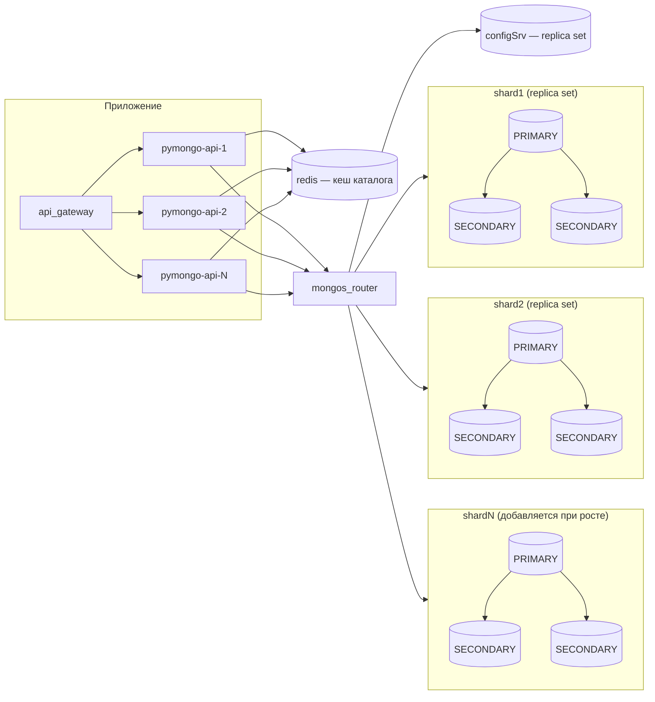
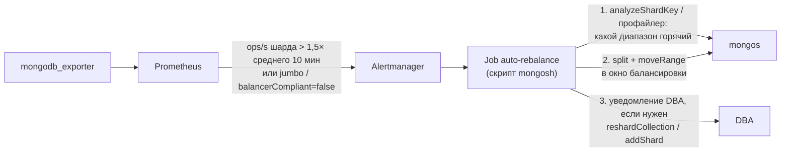
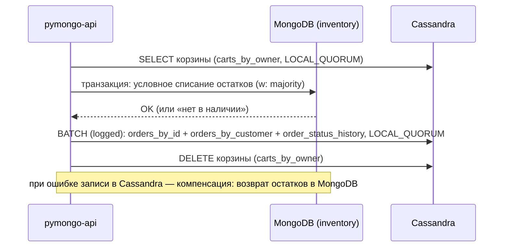
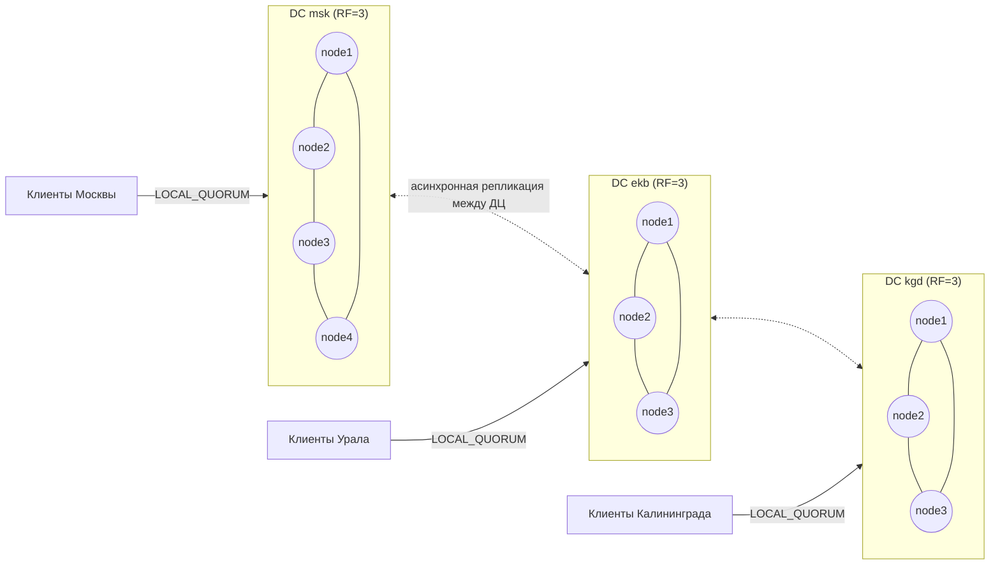

# «Мобильный мир»: архитектура хранения данных (задания 7–10)

Документ описывает схемы коллекций MongoDB и стратегии их шардирования (задание 7), выявление и устранение «горячих» шардов (задание 8), настройку чтения с реплик (задание 9) и перенос части данных в Cassandra (задание 10).

Команды MongoDB приведены для `mongosh` и MongoDB 8.x (в проекте используется `mongo:latest` — 8.3). Ключевые команды из заданий 7 и 8 проверены на кластере из `sharding-repl-cache` (2 шарда × 3 реплики) в отдельной БД `shop`.

## Содержание

1. [Общая архитектура](#1-общая-архитектура)
2. [Задание 7. Схемы коллекций и шардирование](#2-задание-7-схемы-коллекций-и-шардирование)
3. [Задание 8. Выявление и устранение «горячих» шардов](#3-задание-8-выявление-и-устранение-горячих-шардов)
4. [Задание 9. Чтение с реплик и консистентность](#4-задание-9-чтение-с-реплик-и-консистентность)
5. [Задание 10. Миграция на Cassandra](#5-задание-10-миграция-на-cassandra)
6. [Сводка метрик мониторинга и действий](#6-сводка-метрик-мониторинга-и-действий)

---

## 1. Общая архитектура

Магазин продаёт товары нескольких категорий («Электроника», «Книги», «Аудио», «Бытовая техника» и т. д.) в нескольких геозонах (Москва, Екатеринбург, Калининград и др.). Данные о товарах, заказах и корзинах хранятся в БД `shop` шардированного кластера MongoDB.



Общие правила для всех коллекций:

- Шард-ключ выбирается так, чтобы **самые частые запросы были адресными** (mongos отправляет их на один шард), а **запись распределялась равномерно**.
- Монотонно растущие поля (`created_at`, `ObjectId`) не используются как префикс ключа — иначе все вставки идут в последний чанк одного шарда.
- Поля с низкой кардинальностью (`category`, `geo_zone`, `status`) не используются как ключ в одиночку — получаются огромные неделимые (jumbo) чанки и «горячие» шарды.
- Деньги хранятся в `Decimal128`, идентификаторы — в `UUID` (генерируются приложением, не монотонны).

---

## 2. Задание 7. Схемы коллекций и шардирование

### 2.1. Коллекция `products`

#### Схема

| Поле         | Тип                        | Описание                                                        |
|--------------|----------------------------|-----------------------------------------------------------------|
| `_id`        | UUID                       | идентификатор товара                                            |
| `name`       | string                     | наименование                                                    |
| `category`   | string                     | категория (`electronics`, `books`, `audio`, `home`, …)          |
| `price`      | Decimal128                 | цена                                                            |
| `stock`      | object `{ <геозона>: int }`| остаток в каждой геозоне, например `{ msk: 120, ekb: 50, kgd: 30 }` |
| `attrs`      | object                     | доп. атрибуты: `color`, `size`, …                               |
| `updated_at` | Date                       | время последнего изменения                                      |

```js
{
  _id: UUID("42430356-1140-4f30-9028-f4bfdc88d5f4"),
  name: "Смартфон X",
  category: "electronics",
  price: NumberDecimal("59990.00"),
  stock: { msk: 120, ekb: 50, kgd: 30 },
  attrs: { color: "black", size: "6.1\"" },
  updated_at: ISODate("2026-10-03T10:00:00Z")
}
```

Остатки хранятся объектом с ключом-геозоной: списание — одна атомарная операция `$inc` над конкретным полем с условием «остатка хватает».

#### Операции

| Операция                                   | Запрос                                                                 | Частота          |
|--------------------------------------------|------------------------------------------------------------------------|------------------|
| Обновление остатка при покупке             | `updateOne({category, _id, "stock.ekb": {$gte: n}}, {$inc: {"stock.ekb": -n}})` | очень высокая (запись) |
| Каталог: категория + диапазон цен          | `find({category, price: {$gte, $lte}}).sort({price: 1})`               | очень высокая (чтение) |
| Карточка товара                            | `findOne({category, _id})`                                             | высокая (чтение) |

#### Кандидаты в шард-ключ

| Кандидат                         | Распределение записи                     | Каталог по категории        | Карточка / списание остатка    | Вывод |
|----------------------------------|------------------------------------------|-----------------------------|--------------------------------|-------|
| `{ category: 1 }` (range)        | плохое: ~10 значений, «Электроника» = 70% нагрузки на один шард, jumbo-чанки | адресный | адресный, если известна категория | ❌ именно он приводит к горячему шарду (задание 8) |
| `{ _id: "hashed" }`              | идеальное                                | scatter-gather на все шарды | адресный                       | ⚠️ хорошо для записи, но главный запрос каталога идёт на все шарды |
| `{ price: 1 }`                   | неравномерное, цена меняется (смена ключа) | не помогает (нужна категория) | нет                         | ❌ |
| **`{ category: 1, _id: "hashed" }`** | хорошее: товары одной категории делятся на много чанков по хешу `_id` | адресный в чанки нужной категории | адресный (категория известна) | ✅ **выбран** |

#### Выбранная стратегия: составной ключ `{ category: 1, _id: "hashed" }`

- **Почему подходит.** Префикс `category` делает запросы каталога адресными: mongos отправляет их только на шарды с чанками этой категории, а не на все. Хешированный суффикс `_id` даёт высокую кардинальность: «Электроника» не превращается в один неделимый чанк, её чанки балансировщик разносит по разным шардам, и запись остатков распределяется.
- **Категория всегда известна приложению.** Она есть в URL карточки (`/catalog/electronics/<id>`), в выдаче каталога и в позициях заказа (`orders.items[].category`). Поэтому списание остатков и чтение карточки тоже адресные.
- **Управляемость.** Ключ позволяет назначать зоны на категории (`sh.updateZoneKeyRange` по диапазону `{category: "electronics"}`) — это основной инструмент задания 8.
- **Риски.** Запрос по одному `_id` без категории идёт на все шарды (используется только в админке, редко). Смена категории товара — это изменение значения шард-ключа (разрешено, но выполняется как транзакция; операция редкая). Внутри категории распределение данных зависит от балансировщика, за ним нужно следить (раздел 3).

```js
sh.enableSharding("shop")

// Индекс для шард-ключа и индекс для каталога (категория + диапазон цен)
db.products.createIndex({ category: 1, _id: "hashed" })
sh.shardCollection("shop.products", { category: 1, _id: "hashed" })
db.products.createIndex({ category: 1, price: 1 })

// Каталог: адресный запрос + IXSCAN по { category, price }
db.products.find({ category: "electronics", price: { $gte: NumberDecimal("10000"), $lte: NumberDecimal("50000") } })
           .sort({ price: 1 }).limit(48)

// Карточка товара
db.products.findOne({ category: "electronics", _id: UUID("42430356-1140-4f30-9028-f4bfdc88d5f4") })
```

### 2.2. Коллекция `orders`

#### Схема

| Поле           | Тип                       | Описание                                              |
|----------------|---------------------------|-------------------------------------------------------|
| `_id`          | UUID                      | идентификатор заказа                                  |
| `customer_id`  | UUID                      | идентификатор клиента                                 |
| `created_at`   | Date                      | дата и время оформления                               |
| `items`        | array                     | `[{ product_id: UUID, category: string, name: string, price: Decimal128, quantity: int }]` — цена фиксируется на момент заказа |
| `status`       | string                    | `created` → `paid` → `shipped` → `delivered` / `cancelled` |
| `total_amount` | Decimal128                | общая сумма                                           |
| `geo_zone`     | string                    | геозона заказа (`msk`, `ekb`, `kgd`, …)               |

```js
{
  _id: UUID("9d6a0f0e-3a43-4a3e-9f0c-1c7b7c0e5b11"),
  customer_id: UUID("5f1c2e7a-8b0d-4c1e-9a3f-2d4b6e8f0a12"),
  created_at: ISODate("2026-11-27T09:15:00Z"),
  items: [
    { product_id: UUID("42430356-1140-4f30-9028-f4bfdc88d5f4"), category: "electronics",
      name: "Смартфон X", price: NumberDecimal("59990.00"), quantity: 1 },
    { product_id: UUID("0b7e…"), category: "books", name: "Книга Y", price: NumberDecimal("990.00"), quantity: 2 }
  ],
  status: "created",
  total_amount: NumberDecimal("61970.00"),
  geo_zone: "msk"
}
```

#### Операции

| Операция                          | Запрос                                                         |
|-----------------------------------|----------------------------------------------------------------|
| Создание заказа + списание остатков | транзакция: `products.updateOne(...$inc...)` × N + `orders.insertOne` |
| История заказов пользователя      | `find({customer_id}).sort({created_at: -1})`                   |
| Статус заказа                     | `findOne({customer_id, _id}, {status: 1})` — пользователь смотрит только свои заказы |

#### Кандидаты в шард-ключ

| Кандидат                                     | Вставка заказов                       | История пользователя | Статус заказа  | Вывод |
|----------------------------------------------|---------------------------------------|----------------------|----------------|-------|
| `{ created_at: 1 }`                          | ❌ монотонный — все вставки в один шард | scatter-gather       | scatter-gather | ❌ |
| `{ geo_zone: 1 }`                            | ❌ мало значений, Москва перегрузит шард | scatter-gather      | scatter-gather | ❌ |
| `{ _id: "hashed" }`                          | ✅ равномерно                          | ❌ на все шарды       | ✅ адресный     | ⚠️ |
| `{ customer_id: "hashed" }`                  | ✅ равномерно                          | ✅ адресный           | ✅ адресный     | ⚠️ все заказы крупного клиента — в одном неделимом чанке |
| **`{ customer_id: "hashed", created_at: 1 }`** | ✅ равномерно                        | ✅ адресный           | ✅ адресный     | ✅ **выбран** |

#### Выбранная стратегия: хешированное шардирование `{ customer_id: "hashed", created_at: 1 }`

- **Почему подходит.** Хеш `customer_id` равномерно распределяет и данные, и поток вставок по шардам — нет «последнего чанка», куда пишут все. Все заказы одного клиента лежат на одном шарде, поэтому история и статус заказа — адресные запросы (проверено: `explain()` показывает `SINGLE_SHARD`).
- Суффикс `created_at` позволяет делить чанк крупного клиента (например, B2B-покупателя) по времени, поэтому jumbo-чанков нет.
- **Риски.** Поиск заказа только по `_id` (служба поддержки) — scatter-gather; для поддержки это допустимо. Аналитика по геозонам и датам — тоже scatter-gather; её выполняем на отдельной аналитической реплике (раздел 4).

```js
sh.shardCollection("shop.orders", { customer_id: "hashed", created_at: 1 })
db.orders.createIndex({ customer_id: 1, created_at: -1 })   // история с сортировкой
db.orders.createIndex({ status: 1, created_at: 1 })         // фоновые задачи (неоплаченные заказы и т. п.)

// История заказов
db.orders.find({ customer_id: UUID("5f1c2e7a-8b0d-4c1e-9a3f-2d4b6e8f0a12") }).sort({ created_at: -1 }).limit(20)

// Статус заказа
db.orders.findOne({ customer_id: UUID("5f1c2e7a-…"), _id: UUID("9d6a0f0e-…") }, { status: 1 })
```

#### Создание заказа с одновременным списанием остатков

Списание и создание заказа выполняются в распределённой транзакции. Товары и заказ могут лежать на разных шардах, MongoDB это поддерживает. Каждое списание — условный `$inc`: если остатка не хватает, `modifiedCount = 0`, и транзакция откатывается, так что продажи «в минус» не будет.

```js
const session = db.getMongo().startSession()
session.startTransaction({ readConcern: { level: "snapshot" }, writeConcern: { w: "majority" } })
const shop = session.getDatabase("shop")
try {
  for (const it of order.items) {
    const r = shop.products.updateOne(
      { category: it.category, _id: it.product_id, [`stock.${order.geo_zone}`]: { $gte: it.quantity } },
      { $inc: { [`stock.${order.geo_zone}`]: -it.quantity }, $currentDate: { updated_at: true } }
    )
    if (r.modifiedCount === 0) throw new Error(`Недостаточно товара ${it.product_id}`)
  }
  shop.orders.insertOne(order)
  session.commitTransaction()
} catch (e) {
  session.abortTransaction()
  throw e
}
```

### 2.3. Коллекция `carts`

#### Схема

| Поле         | Тип            | Описание                                                                 |
|--------------|----------------|--------------------------------------------------------------------------|
| `_id`        | UUID           | идентификатор корзины                                                    |
| `owner`      | string         | **владелец корзины, шард-ключ**: `"u:<user_id>"` для пользователя или `"s:<session_id>"` для гостя |
| `user_id`    | UUID \| null   | идентификатор пользователя                                               |
| `session_id` | string \| null | идентификатор сессии гостя                                               |
| `items`      | array          | `[{ product_id: UUID, quantity: int }]`                                  |
| `status`     | string         | `active` \| `ordered` \| `abandoned`                                     |
| `created_at` | Date           | создание                                                                 |
| `updated_at` | Date           | последнее изменение                                                      |
| `expires_at` | Date           | время удаления (TTL): гостевая — `now + 7 дней`, пользовательская — `now + 90 дней`, продлевается при изменении |

Поле `owner` — вычисляемое: корзину ищут то по `session_id`, то по `user_id`, а шард-ключ может быть только один. `owner` объединяет оба случая в одно поле с высокой кардинальностью, и оба вида поиска становятся адресными.

```js
{
  _id: UUID("c1d2…"),
  owner: "s:7f3a9c",
  user_id: null,
  session_id: "7f3a9c",
  items: [ { product_id: UUID("42430356-…"), quantity: 1 } ],
  status: "active",
  created_at: ISODate("2026-11-27T09:00:00Z"),
  updated_at: ISODate("2026-11-27T09:05:00Z"),
  expires_at: ISODate("2026-12-04T09:05:00Z")
}
```

#### Кандидаты в шард-ключ

| Кандидат                  | Проблема                                                                                    | Вывод |
|---------------------------|---------------------------------------------------------------------------------------------|-------|
| `{ _id: "hashed" }`       | корзину ищут не по `_id`, а по `session_id` / `user_id` → каждый запрос на все шарды         | ❌ |
| `{ user_id: "hashed" }`   | у всех гостей `user_id = null` → все гостевые корзины в одном неделимом чанке, горячий шард  | ❌ |
| `{ session_id: "hashed" }`| пользователь заходит с разных устройств (разные сессии) → его корзину не найти адресно       | ❌ |
| `{ status: 1 }`           | 3 значения                                                                                   | ❌ |
| **`{ owner: "hashed" }`** | равномерно, оба вида поиска адресные                                                         | ✅ **выбран** |

#### Выбранная стратегия: хешированное шардирование `{ owner: "hashed" }`

- **Почему подходит.** Корзины создаются очень часто (каждый новый гость), хеш распределяет вставки равномерно. Все операции с корзиной — поиск, добавление, удаление и отметка «заказана» — идут по `owner` и попадают на один шард. Корзины маленькие, документ одной корзины не может стать горячим, как популярный товар.
- **Одна активная корзина на владельца** гарантируется частичным уникальным индексом. Уникальный индекс в шардированной коллекции должен начинаться с шард-ключа, а `{owner: 1, status: 1}` этому условию соответствует.
- **TTL-индекс** по `expires_at` удаляет старые корзины автоматически, на каждом шарде.
- **Риски.** Слияние гостевой и пользовательской корзины затрагивает два разных `owner`, то есть, возможно, два шарда. Это редкая операция, её выполняем в транзакции.

```js
sh.shardCollection("shop.carts", { owner: "hashed" })
db.carts.createIndex({ owner: 1, status: 1 }, { unique: true, partialFilterExpression: { status: "active" } })
db.carts.createIndex({ expires_at: 1 }, { expireAfterSeconds: 0 })

// Создание корзины гостя
db.carts.insertOne({ _id: UUID(), owner: "s:7f3a9c", session_id: "7f3a9c", user_id: null, items: [],
                     status: "active", created_at: new Date(), updated_at: new Date(),
                     expires_at: new Date(Date.now() + 7 * 24 * 3600 * 1000) })

// Получение текущей корзины
db.carts.findOne({ owner: "s:7f3a9c", status: "active" })   // гость: { session_id, status: "active" }
db.carts.findOne({ owner: "u:5f1c2e7a-…", status: "active" }) // пользователь: { user_id, status: "active" }

// Добавление или замена товара (pipeline update: убираем старую позицию и добавляем новую)
db.carts.updateOne({ owner: "s:7f3a9c", status: "active" }, [
  { $set: {
      items: { $concatArrays: [
        { $filter: { input: "$items", cond: { $ne: ["$$this.product_id", pid] } } },
        [ { product_id: pid, quantity: 3 } ] ] },
      updated_at: "$$NOW",
      expires_at: { $dateAdd: { startDate: "$$NOW", unit: "day", amount: 7 } } } }
])

// Удаление товара
db.carts.updateOne({ owner: "s:7f3a9c", status: "active" },
                   { $pull: { items: { product_id: pid } }, $currentDate: { updated_at: true } })

// Отметка корзины как заказанной (в той же транзакции, что и создание заказа)
db.carts.updateOne({ owner: "u:5f1c2e7a-…", status: "active" },
                   { $set: { status: "ordered" }, $currentDate: { updated_at: true } })
```

#### Слияние гостевой корзины в пользовательскую при логине

```js
const s = db.getMongo().startSession()
s.startTransaction({ readConcern: { level: "snapshot" }, writeConcern: { w: "majority" } })
const carts = s.getDatabase("shop").carts
const guest = carts.findOne({ owner: "s:7f3a9c", status: "active" })           // 1. читаем гостевую
if (guest) {
  const user = carts.findOne({ owner: "u:" + userId, status: "active" })
  const merged = mergeItems(user ? user.items : [], guest.items)               // суммируем quantity по product_id
  carts.updateOne({ owner: "u:" + userId, status: "active" },                  // 2. кладём items в пользовательскую
    { $set: { items: merged, user_id: userId, updated_at: new Date() },
      $setOnInsert: { _id: UUID(), session_id: null, created_at: new Date(),
                      expires_at: new Date(Date.now() + 90 * 24 * 3600 * 1000) } },
    { upsert: true })
  carts.updateOne({ _id: guest._id, owner: guest.owner },                      // 3. гостевую — в abandoned
    { $set: { status: "abandoned", updated_at: new Date() } })
}
s.commitTransaction()
```

### 2.4. Итог по заданию 7

| Коллекция  | Шард-ключ                              | Стратегия                         | Адресные операции                                 | Основной риск                             |
|------------|----------------------------------------|-----------------------------------|---------------------------------------------------|-------------------------------------------|
| `products` | `{ category: 1, _id: "hashed" }`       | составной: range по категории + hash | каталог, карточка, списание остатков             | популярная категория / товар (раздел 3)   |
| `orders`   | `{ customer_id: "hashed", created_at: 1 }` | hashed                         | создание, история, статус                         | поиск по `_id` без клиента — scatter-gather |
| `carts`    | `{ owner: "hashed" }`                  | hashed                            | все операции с корзиной                           | слияние корзин — транзакция на 2 шарда    |

---

## 3. Задание 8. Выявление и устранение «горячих» шардов

### 3.1. Как возникает проблема

Если `products` шардирована по `{ category: 1 }`, все товары «Электроники» оказываются в нескольких соседних чанках, а значит, на одном шарде. Значение категории одно, поэтому чанк нельзя разделить, и он становится jumbo. 70% запросов приходится на этот шард, а остальные простаивают. Стандартный балансировщик MongoDB (6.0+) выравнивает шарды **по объёму данных, а не по нагрузке**. Даже при равномерном распределении данных шард, где лежит популярная категория или популярный товар, может оказаться перегружен.

Горячие точки бывают трёх уровней — для каждого своё решение:

| Уровень              | Пример                                     | Признак                                          | Решение                                       |
|----------------------|--------------------------------------------|--------------------------------------------------|-----------------------------------------------|
| Горячий **ключ** (категория) | все товары «Электроники» на shard1 | один шард: ops/CPU в разы выше среднего; jumbo-чанки | смена/уточнение шард-ключа, зоны             |
| Горячий **диапазон** (чанк) | хеш-диапазон с популярными товарами | данные ровные, нагрузка — нет                    | `split` + `moveRange` на менее нагруженный шард |
| Горячий **документ** | остаток «Смартфона X» в чёрную пятницу    | write conflicts, рост времени блокировок одного документа | вынести остатки в отдельные документы, кеш, резервирование |

### 3.2. Метрики для отслеживания состояния шардов

Сбор метрик: `percona/mongodb_exporter` на каждом `mongod` и `mongos` → Prometheus → Grafana и Alertmanager. Для разовой диагностики подходят команды, перечисленные в таблице.

| Группа | Метрика (источник) | Что показывает | Порог для алерта |
|--------|--------------------|----------------|------------------|
| **Нагрузка по шардам** | `opcounters` (query/insert/update/delete) каждого PRIMARY (`db.serverStatus().opcounters`) | ops/s по шардам | ops/s шарда > **1,5 × среднего** по шардам 10 мин |
| | CPU, load average узла | загрузка шарда | > 75% 10 мин |
| | `opLatencies.reads/writes` (`serverStatus`), p95/p99 из профайлера | задержка операций | p99 > 2× базовой линии |
| | `globalLock.currentQueue`, `wiredTiger.concurrentTransactions` (свободные read/write tickets) | очередь операций, нехватка тикетов | очередь > 0 стабильно, тикетов < 10% |
| | `wiredTiger.cache` (`bytes currently in the cache`, `tracked dirty bytes`) | давление на кеш | dirty > 5%, cache > 90% |
| | `metrics.operation.writeConflicts` (`serverStatus`) | конфликты записи — признак горячего документа | рост > базовой линии |
| **Распределение данных** | `$shardedDataDistribution` (документы и байты коллекции по шардам) | перекос данных | разница между шардами > 20% |
| | число чанков по шардам, jumbo-чанки (`config.chunks`, `sh.status()`) | неделимые чанки | любой jumbo-чанк |
| | `sh.balancerCollectionStatus(ns)` | сбалансирована ли коллекция | `balancerCompliant: false` дольше окна балансировки |
| **Балансировщик** | `config.changelog` (`moveChunk.*`, `moveRange`), `sh.isBalancerRunning()` | миграции, ошибки миграций | ошибки миграций; миграции в пиковые часы |
| **Запросы** | доля scatter-gather запросов на mongos (`nShards` в логах медленных запросов) | неудачный ключ / запросы без ключа | > 10% запросов каталога |
| | `top` (время чтения/записи по коллекциям), `$collStats` | какая коллекция грузит шард | — |
| | профайлер (`system.profile`, `slowms`), `$currentOp` | конкретные медленные и горячие запросы | — |
| | `analyzeShardKey` + `configureQueryAnalyzer` | частоты значений ключа, доля адресных чтений и записей | `mostCommonValues` > 20% документов |
| **Репликация** | replication lag (`rs.printSecondaryReplicationInfo()`) | отставание вторичных узлов перегруженного шарда | > 10 с |
| **Приложение** | RPS и p99 по эндпоинтам и категориям, hit ratio Redis | откуда пришла нагрузка | hit ratio < 80% |

Команды диагностики:

```js
// 1. Распределение данных коллекции по шардам
db.getSiblingDB("admin").aggregate([
  { $shardedDataDistribution: {} },
  { $match: { ns: "shop.products" } }
])
db.products.getShardDistribution()

// 2. Состояние балансировщика и коллекции
sh.status()
sh.balancerCollectionStatus("shop.products")      // balancerCompliant, firstComplianceViolation
db.getSiblingDB("config").chunks.find({ jumbo: true })

// 3. Нагрузка на конкретном шарде (на PRIMARY шарда)
db.serverStatus().opcounters
db.serverStatus().metrics.operation.writeConflicts
db.adminCommand({ top: 1 }).totals["shop.products"]
db.currentOp({ active: true, ns: /^shop\./, secs_running: { $gte: 1 } })

// 4. Анализ шард-ключа: кардинальность, частые значения, адресность запросов
db.adminCommand({ configureQueryAnalyzer: "shop.products", mode: "full", samplesPerSecond: 10 })
db.adminCommand({ analyzeShardKey: "shop.products", key: { category: 1 } })
// keyCharacteristics.mostCommonValues → { category: "electronics", frequency: 70% } — признак проблемы
// readDistribution.percentageOfSingleShardReads, writeDistribution.percentageOfShardKeyUpdates и т. п.

// 5. Профайлер медленных запросов на шарде
db.setProfilingLevel(1, { slowms: 50 })
db.system.profile.aggregate([
  { $match: { ns: "shop.products" } },
  { $group: { _id: "$command.filter.category", cnt: { $sum: 1 }, avgMs: { $avg: "$millis" } } },
  { $sort: { cnt: -1 } }
])
```

### 3.3. Механизмы устранения и автоматического перераспределения

#### 1. Правильный шард-ключ: `reshardCollection` / `refineCollectionShardKey`

Если коллекция уже шардирована по `{ category: 1 }`, ключ меняется **онлайн**, без остановки приложения.

```js
// Вариант А: дописать суффикс к существующему ключу (быстро, без копирования данных;
// чанки «Электроники» становятся делимыми)
db.products.createIndex({ category: 1, _id: 1 })
db.adminCommand({ refineCollectionShardKey: "shop.products", key: { category: 1, _id: 1 } })

// Вариант Б: полный решардинг на ключ из задания 7 (данные копируются в фоне, запись не блокируется,
// в конце — короткая блокировка ~2 с). Запускать вне пиков.
db.adminCommand({ reshardCollection: "shop.products", key: { category: 1, _id: "hashed" } })
db.getSiblingDB("admin").aggregate([{ $currentOp: { allUsers: true, localOps: false } },
                                    { $match: { type: "op", "originatingCommand.reshardCollection": "shop.products" } }])
```

#### 2. Работа балансировщика

После уточнения ключа балансировщик сам разносит чанки «Электроники» по шардам. Настройки:

```js
use config
// Миграции только ночью, чтобы не тратить ресурсы в пик
db.settings.updateOne({ _id: "balancer" }, { $set: { activeWindow: { start: "01:00", stop: "06:00" } } }, { upsert: true })
// Размер чанка меньше → балансировщик раньше начинает выравнивать горячую коллекцию
db.settings.updateOne({ _id: "chunksize" }, { $set: { value: 64 } }, { upsert: true })  // МБ, по умолчанию 128
// Только для одной коллекции
db.adminCommand({ configureCollectionBalancing: "shop.products", chunkSize: 32 })

sh.startBalancer()
sh.getBalancerState()
```

#### 3. Перенос горячего диапазона (нагрузка, а не объём)

Балансировщик не знает о нагрузке, поэтому горячий диапазон делится и переносится вручную или скриптом:

```js
// Разделить диапазон «Электроники» и перенести половину на менее нагруженный шард
db.adminCommand({ split: "shop.products", middle: { category: "electronics", _id: NumberLong("0") } })
db.adminCommand({ moveRange: "shop.products",
                  min: { category: "electronics", _id: NumberLong("0") },
                  toShard: "shard3" })
```

#### 4. Зоны: выделить шарды под популярную категорию

Зоны закрепляют диапазон ключа за набором шардов. «Электронику» распределяем по нескольким (более мощным) шардам, остальные категории — по другим. Балансировщик сам поддерживает это правило.

```js
sh.addShardToZone("shard1", "hot")
sh.addShardToZone("shard3", "hot")
sh.addShardToZone("shard2", "regular")

sh.updateZoneKeyRange("shop.products",
  { category: "electronics", _id: MinKey }, { category: "electronics", _id: MaxKey }, "hot")
sh.updateZoneKeyRange("shop.products",
  { category: MinKey, _id: MinKey }, { category: "electronics", _id: MinKey }, "regular")
sh.updateZoneKeyRange("shop.products",
  { category: "electronics", _id: MaxKey }, { category: MaxKey, _id: MaxKey }, "regular")
```

#### 5. Горизонтальное масштабирование

```js
sh.addShard("shard3/shard3-1:27018,shard3-2:27018,shard3-3:27018")
// балансировщик сам переносит на новый шард часть чанков; при зонах — добавляем шард в зону "hot"
```

#### 6. Разгрузка чтения горячего шарда

- Каталог и карточки товаров кешируются в Redis (TTL 30–60 с) и CDN. Для «Электроники» кеш — первый уровень защиты.
- Чтения каталога направляются на SECONDARY (раздел 4), так что 3 узла шарда делят нагрузку чтения.

#### 7. Горячий документ (остатки популярного товара)

Разделить один документ по шардам нельзя. Если `writeConflicts` растут на одном товаре:

- остатки выносятся в отдельную коллекцию `inventory` с документом на пару «товар + геозона» и шард-ключом `{ product_id: "hashed", geo_zone: 1 }`. Покупки в Москве и Калининграде больше не конкурируют за один документ;
- для товаров из акций применяется «бакетирование» остатка: остаток делится на N документов-корзин `{product_id, geo_zone, bucket: 0..N-1}`, а списание идёт из случайной корзины.

#### 8. Автоматизация



Скрипт автоматического переноса горячего диапазона (запускается по алерту):

```js
// auto-rebalance.js: переносит самый нагруженный чанк коллекции с горячего шарда на самый холодный
const ns = "shop.products"
const shards = db.getSiblingDB("config").shards.find().toArray().map(s => s._id)
// нагрузка по шардам = опкаунтеры PRIMARY (снимаем дважды с интервалом)
const ops = Object.fromEntries(shards.map(id => [id, opsPerSecOnShard(id)]))   // через Prometheus API или connect к шарду
const hot = shards.reduce((a, b) => ops[a] > ops[b] ? a : b)
const cold = shards.reduce((a, b) => ops[a] < ops[b] ? a : b)
if (ops[hot] > 1.5 * avg(Object.values(ops))) {
  // самый часто запрашиваемый диапазон по данным профайлера горячего шарда
  const hotChunk = findHottestChunk(ns, hot)                                       // { min, max }
  db.adminCommand({ split: ns, find: hotChunk.min })                               // делим пополам
  db.adminCommand({ moveRange: ns, min: hotChunk.min, toShard: cold })             // переносим половину
  print(`moved ${tojson(hotChunk.min)} ${hot} -> ${cold}`)
}
```

### 3.4. Порядок действий при горячем шарде (runbook)

1. Алерт: ops/s или CPU одного шарда > 1,5× среднего.
2. `$shardedDataDistribution` + `sh.balancerCollectionStatus` → проблема в **данных** (перекос, jumbo) или в **нагрузке** (данные ровные)?
3. `analyzeShardKey` + профайлер → какой ключ, диапазон или документ горячий.
4. Данные перекошены / jumbo → `refineCollectionShardKey` или `reshardCollection`.
5. Нагрузка на диапазон → `split` + `moveRange` или зоны; при общем росте → `addShard`.
6. Горячий документ → вынос остатков в `inventory`, бакетирование.
7. Чтение → Redis/CDN и чтение с SECONDARY.

---

## 4. Задание 9. Чтение с реплик и консистентность

### 4.1. Принципы

- **PRIMARY** — для чтений, по результату которых принимается решение (хватает ли остатка, можно ли оплатить, что лежит в корзине перед оформлением), и для чтений «своих» только что записанных данных.
- **SECONDARY** (`secondaryPreferred`) — для массовых чтений, где устаревание на несколько секунд не меняет бизнес-результат: каталог, описания товаров, история заказов, аналитика.
- Запись — всегда `w: "majority"`, поэтому подтверждённые данные не теряются при смене PRIMARY.
- Ограничение отставания: `maxStalenessSeconds` — драйвер не читает с реплики, отстающей сильнее. **Минимально допустимое значение — 90 с** (ограничение MongoDB). Поэтому более жёсткие требования (5–10 с) обеспечиваются мониторингом лага: реплику, отставшую больше порога, выводим из чтения.
- Для «прочитать своё» на SECONDARY используются **causal consistency sessions**: драйвер передаёт `afterClusterTime`, и SECONDARY ждёт, пока догонит последнюю запись пользователя.

### 4.2. Таблица операций чтения

| Коллекция  | Операция чтения                                      | Узел | Read preference / concern | Допустимая задержка репликации | Обоснование |
|------------|------------------------------------------------------|------|---------------------------|-------------------------------|-------------|
| `products` | Каталог: поиск по категории + фильтр по цене          | **SECONDARY** | `secondaryPreferred`, `maxStalenessSeconds=90`, `readConcern: local` | ≤ 5 с (норма), ≤ 90 с (жёсткий предел) | самая массовая операция; цены и ассортимент меняются редко, и старая на пару секунд цена в выдаче ничего не ломает: цена фиксируется при создании заказа на PRIMARY. Разгружает PRIMARY горячего шарда (задание 8) |
| `products` | Карточка товара (описание, атрибуты, цена)            | **SECONDARY** | `secondaryPreferred`, `maxStalenessSeconds=90` | ≤ 5 с | описание и атрибуты почти не меняются; цена перепроверяется при оформлении |
| `products` | Отображение «в наличии / осталось N шт.» в каталоге и карточке | **SECONDARY** | `secondaryPreferred` | ≤ 5 с | это подсказка для покупателя; остаток меняется часто, но окончательная проверка — при оформлении заказа на PRIMARY |
| `products` | Проверка и списание остатка при создании заказа       | **PRIMARY** | `primary`, транзакция `readConcern: snapshot`, `w: majority` | 0 | риск продать недоступный товар; списание — условный `$inc` на PRIMARY |
| `products` | Админка: редактирование цены и остатков                | **PRIMARY** | `primary` | 0 | менеджер должен видеть актуальные данные, которые он меняет |
| `orders`   | Статус заказа (страница заказа, оплата, отслеживание)  | **PRIMARY** | `primary`, `readConcern: majority` | 0 | устаревший статус («не оплачен» после оплаты) приводит к повторной оплате и обращениям в поддержку; статус меняется в ключевые моменты, и пользователь ждёт увидеть изменение сразу |
| `orders`   | Чтение заказа сразу после создания (страница «Спасибо за заказ») | **PRIMARY** | `primary` | 0 | read-your-writes: заказ должен быть виден сразу |
| `orders`   | История заказов пользователя (список)                  | **SECONDARY** | `secondaryPreferred` + causal session, `readConcern: majority` | ≤ 10 с | история только дополняется, запрос тяжёлый (сортировка, много документов). Causal session гарантирует, что только что оформленный заказ попадёт в список |
| `orders`   | Аналитика и отчёты (продажи по геозонам и категориям)  | **SECONDARY** (аналитический узел) | `secondary` + тег `{ use: "analytics" }` | ≤ 5 мин | тяжёлые агрегации не должны влиять на PRIMARY; минутная задержка для отчётов допустима |
| `carts`    | Получение текущей корзины `{owner, status: "active"}`  | **PRIMARY** | `primary` | 0 | пользователь добавил товар и сразу открыл корзину — товар должен быть там; корзина меняется очень часто, а запрос дешёвый и адресный |
| `carts`    | Чтение корзины при оформлении заказа и слиянии корзин  | **PRIMARY** | `primary`, транзакция | 0 | от содержимого корзины зависит состав заказа, ошибка = неправильный заказ |
| `carts`    | Маркетинг: брошенные корзины (`status: "abandoned"`, `updated_at < now-1d`) | **SECONDARY** (аналитический узел) | `secondary` + тег `{ use: "analytics" }` | ≤ 15 мин | рассылки «вы забыли товар» не требуют точности до секунды |

### 4.3. Допустимая задержка репликации — сводка

| Класс данных                              | Допустимый лаг | Как обеспечивается |
|-------------------------------------------|----------------|--------------------|
| Решения о деньгах и остатках, статус заказа, корзина | 0 (только PRIMARY) | `readPreference: primary`, `w: majority` |
| Каталог, карточки, индикатор наличия      | 5 с (алерт), 90 с (жёсткий предел драйвера) | `maxStalenessSeconds=90`, алерт по лагу > 5 с |
| История заказов                           | 10 с + read-your-writes | causal consistency session |
| Аналитика, маркетинг                      | 5–15 мин        | отдельный SECONDARY с тегом `analytics`, `priority: 0` |

Если лаг SECONDARY превышает порог дольше минуты, чтения каталога временно переключаются на `primaryPreferred`, и выясняется причина (перегрузка шарда, сеть, длинные операции).

### 4.4. Примеры настроек

```js
// Отдельный аналитический узел в replica set шарда (не становится PRIMARY)
cfg = rs.conf()
cfg.members[2].priority = 0
cfg.members[2].tags = { use: "analytics" }
rs.reconfig(cfg)

// Мониторинг лага
rs.printSecondaryReplicationInfo()
```

Строки подключения приложения:

```text
# каталог товаров
mongodb://mongos_router:27020/shop?readPreference=secondaryPreferred&maxStalenessSeconds=90

# заказы, корзины, оформление
mongodb://mongos_router:27020/shop?readPreference=primary&w=majority&readConcernLevel=majority

# аналитика
mongodb://mongos_router:27020/shop?readPreference=secondary&readPreferenceTags=use:analytics
```

На уровне отдельной операции (`mongosh` / драйвер):

```js
db.products.find({ category: "electronics", price: { $lte: NumberDecimal("30000") } })
           .readPref("secondaryPreferred", [], { maxStalenessSeconds: 90 })

// Causal session для истории заказов: заказ, созданный в этой сессии, гарантированно виден на SECONDARY
const s = db.getMongo().startSession({ causalConsistency: true })
s.getDatabase("shop").orders.insertOne(order, { writeConcern: { w: "majority" } })
s.getDatabase("shop").orders.find({ customer_id: order.customer_id })
  .readPref("secondaryPreferred").readConcern("majority").sort({ created_at: -1 })
```

---

## 5. Задание 10. Миграция на Cassandra

### 5.1. Задание 10.1. Какие данные переносить

Проблема MongoDB с range-шардированием в пике: добавление шарда запускает массовую миграцию чанков, и это съедает ресурсы, когда нагрузка максимальна. Cassandra распределяет данные по **кольцу токенов (consistent hashing, Murmur3) с vnodes**. Новый узел забирает у соседей только свою долю диапазонов (≈ 1/N данных), остальные узлы данные не перемещают. Репликация leaderless: запись принимает любой узел, отказ узла не требует выборов.

Но у Cassandra нет транзакций между партициями, а сравнение-и-запись (LWT, Paxos) выполняется в 4 раунда, что в 4–8 раз медленнее обычной записи. Поэтому переносим только то, что укладывается в модель «запись по ключу, чтение по ключу, конечная согласованность».

| Данные                        | Критичность целостности | Требования к скорости и масштабу | Cassandra? | Обоснование |
|-------------------------------|-------------------------|----------------------------------|------------|-------------|
| **Корзины**                   | средняя: потеря позиции неприятна, но не финансовая | очень много записей (каждый клик «в корзину»), пик в чёрную пятницу, нужен TTL | ✅ **да** | доступ строго по владельцу, естественный TTL, upsert без чтения, высокая доступность важнее строгой согласованности |
| **Пользовательские сессии**   | низкая: потеря = повторный логин | максимум операций, низкая задержка, гео-распределение | ✅ **да** | чистый key-value с TTL, запись каждого запроса |
| **Заказы (карточка заказа)**  | **высокая**: деньги, юридически значимые данные | тысячи вставок в секунду в пик; читаются по ID | ✅ **да**, с `LOCAL_QUORUM` и LWT для смены статуса | заказ пишется один раз, статус меняется несколько раз за жизнь (LWT — редко); нужна гарантированная запись в пик без даунтайма при масштабировании |
| **История заказов пользователя** | высокая (производная от заказов) | постоянно растёт, читается по пользователю, сортировка по времени | ✅ **да** | классический time-series по ключу: partition = пользователь (+ период), clustering = время |
| **История статусов заказа**   | высокая                 | только дописывается                | ✅ **да**   | append-only журнал, идеален для Cassandra |
| **Остатки товаров**           | **критическая**: продать отсутствующий товар нельзя | частые декременты | ❌ **нет**, остаются в MongoDB (`inventory` из задания 8) | нужно атомарное «проверить и списать». Счётчики Cassandra (`counter`) не идемпотентны и не умеют условие `≥ n`, а LWT на каждой покупке горячего товара — бутылочное горлышко Paxos на одной партиции |
| **Каталог товаров**           | средняя                 | чтения ≫ записей, фильтры по категории/цене/атрибутам | ❌ **нет**, MongoDB + Redis + CDN | гибкие фильтры и вторичные индексы — сильная сторона MongoDB; Cassandra требует таблицу под каждый запрос, а партиция «Электроника» снова стала бы горячей |

Итог: в Cassandra переносятся **корзины, сессии, заказы, история заказов и история статусов**. Это самые нагруженные по записи данные с доступом по ключу. Остатки и каталог остаются в MongoDB.

Создание заказа после миграции выглядит так:



### 5.2. Задание 10.2. Модель данных

#### Кластер и keyspace



```sql
CREATE KEYSPACE shop
  WITH replication = { 'class': 'NetworkTopologyStrategy', 'msk': 3, 'ekb': 3, 'kgd': 3 }
  AND durable_writes = true;
```

- `NetworkTopologyStrategy`, RF = 3 в каждом ДЦ. `LOCAL_QUORUM` (2 из 3) переживает отказ одного узла в ДЦ, а пользователь работает с ближайшим ДЦ без межрегиональной задержки.
- `cassandra.yaml`: `num_tokens: 16`, `allocate_tokens_for_local_replication_factor: 3` — равномерное распределение токенов по узлам. Partitioner `Murmur3Partitioner`.

```sql
CREATE TYPE shop.order_item (
  product_id uuid,
  category   text,
  name       text,
  price      decimal,
  quantity   int
);
```

#### `orders_by_id` — карточка заказа

```sql
CREATE TABLE shop.orders_by_id (
  order_id     uuid,
  customer_id  uuid,
  created_at   timestamp,
  status       text,
  total_amount decimal,
  geo_zone     text,
  items        frozen<list<frozen<order_item>>>,
  updated_at   timestamp,
  PRIMARY KEY ((order_id))
) WITH read_repair = 'BLOCKING'
  AND gc_grace_seconds = 864000;

-- статус заказа
SELECT status, updated_at FROM shop.orders_by_id WHERE order_id = ?;   -- LOCAL_QUORUM
-- смена статуса — только из ожидаемого (защита от гонки «оплачен» / «отменён»)
UPDATE shop.orders_by_id SET status = 'paid', updated_at = toTimestamp(now())
  WHERE order_id = ? IF status = 'created';                            -- LOCAL_SERIAL
```

- **Partition key `order_id` (UUID)** — случайный, поэтому распределение по кольцу идеально равномерное; одна партиция = один заказ (единицы КБ), горячих партиций нет.

#### `orders_by_customer` — история заказов пользователя

```sql
CREATE TABLE shop.orders_by_customer (
  customer_id  uuid,
  year         int,          -- бакет по времени
  created_at   timestamp,
  order_id     uuid,
  status       text,
  total_amount decimal,
  geo_zone     text,
  PRIMARY KEY ((customer_id, year), created_at, order_id)
) WITH CLUSTERING ORDER BY (created_at DESC, order_id ASC)
  AND read_repair = 'BLOCKING';

-- последние заказы пользователя
SELECT * FROM shop.orders_by_customer WHERE customer_id = ? AND year = 2026 LIMIT 20;
```

- **Partition key `(customer_id, year)`.** Все заказы клиента за год лежат в одной партиции, и история читается одним последовательным чтением с одной реплики. Бакет `year` ограничивает рост партиции: даже у B2B-клиента партиция не разрастается бесконечно. Для очень активных клиентов бакет можно сделать месячным (`yyyymm`).
- **Clustering `created_at DESC, order_id`** — сортировка «новые сверху» уже на диске, `order_id` делает ключ уникальным при одинаковом времени.
- Таблица денормализована: при смене статуса обновляются обе таблицы в logged batch.

#### `order_status_history` — журнал статусов

```sql
CREATE TABLE shop.order_status_history (
  order_id   uuid,
  changed_at timeuuid,
  status     text,
  comment    text,
  PRIMARY KEY ((order_id), changed_at)
) WITH CLUSTERING ORDER BY (changed_at DESC);

-- создание заказа целиком: одна logged batch, атомарна (все или ничего, но не изолирована)
BEGIN BATCH
  INSERT INTO shop.orders_by_id (order_id, customer_id, created_at, status, total_amount, geo_zone, items, updated_at)
    VALUES (?, ?, ?, 'created', ?, ?, ?, ?);
  INSERT INTO shop.orders_by_customer (customer_id, year, created_at, order_id, status, total_amount, geo_zone)
    VALUES (?, 2026, ?, ?, 'created', ?, ?);
  INSERT INTO shop.order_status_history (order_id, changed_at, status) VALUES (?, now(), 'created');
APPLY BATCH;
```

#### `carts_by_owner` — корзины

```sql
CREATE TABLE shop.carts_by_owner (
  owner       text,          -- 'u:<user_id>' | 's:<session_id>'
  product_id  uuid,
  quantity    int,
  cart_id     uuid      STATIC,
  status      text      STATIC,   -- active | ordered | abandoned
  created_at  timestamp STATIC,
  updated_at  timestamp STATIC,
  PRIMARY KEY ((owner), product_id)
) WITH default_time_to_live = 604800      -- 7 дней (гостевые); для пользовательских USING TTL 7776000
  AND gc_grace_seconds = 259200           -- 3 дня: удаления частые, repair чаще
  AND read_repair = 'NONE';

-- получить корзину
SELECT product_id, quantity, status FROM shop.carts_by_owner WHERE owner = 's:7f3a9c';
-- добавить / заменить товар (upsert, без чтения)
UPDATE shop.carts_by_owner USING TTL 604800
  SET quantity = 3, updated_at = toTimestamp(now()), status = 'active'
  WHERE owner = 's:7f3a9c' AND product_id = ?;
-- удалить товар
DELETE FROM shop.carts_by_owner WHERE owner = 's:7f3a9c' AND product_id = ?;
-- слияние при логине: приложение читает гостевую партицию, пишет строки в 'u:<id>' и помечает гостевую
UPDATE shop.carts_by_owner SET status = 'abandoned' WHERE owner = 's:7f3a9c';
```

- **Partition key `owner`** — одна партиция на корзину; ключи с высокой кардинальностью распределяются равномерно. Партиция маленькая (десятки строк).
- **Clustering `product_id`** — одна строка на товар. Добавление и замена — это upsert без read-before-write, удаление — `DELETE` строки. Конфликтов параллельного изменения массива, как в документе MongoDB, нет.
- **Static-колонки** хранят метаданные корзины один раз на партицию.
- **TTL** заменяет `expires_at`: Cassandra удаляет старые корзины сама.

#### `user_sessions` — сессии

```sql
CREATE TABLE shop.user_sessions (
  session_id text,
  user_id    uuid,
  geo_zone   text,
  data       map<text, text>,
  last_seen  timestamp,
  PRIMARY KEY ((session_id))
) WITH default_time_to_live = 86400       -- сессия живёт сутки с последней записи
  AND read_repair = 'NONE';
```

#### Горячие партиции и решардинг

| Таблица               | Partition key            | Почему нет горячих партиций                              | Влияние добавления узлов |
|-----------------------|--------------------------|----------------------------------------------------------|--------------------------|
| `orders_by_id`        | `order_id`               | UUID случайный, одна партиция — один заказ               | новый узел забирает ≈ 1/N токенов у соседей, остальные узлы не затронуты |
| `orders_by_customer`  | `(customer_id, year)`    | клиенты распределены хешем; бакет ограничивает размер партиции | то же |
| `order_status_history`| `order_id`               | единицы строк на заказ                                  | то же |
| `carts_by_owner`      | `owner`                  | миллионы маленьких корзин; TTL не даёт копиться мусору  | то же |
| `user_sessions`       | `session_id`             | случайный идентификатор                                  | то же |

Почему решардинг не повторит проблему MongoDB:

- В ключе **нет «номера шарда» и нет диапазонов**. Положение партиции определяет `Murmur3(partition key)`, и при добавлении узла меняется только владелец части токенов.
- `vnodes` (16 токенов на узел): новый узел забирает данные понемногу у многих узлов, и нагрузка стриминга размазывается.
- Узлы добавляются по одному. Стриминг ограничивается `stream_throughput_outbound` (например, 200 Мбит/с), чтобы не просела latency. После добавления узла запускается `nodetool cleanup` на старых узлах вне пика.
- Ни одна сущность не ключуется по категории или геозоне, поэтому популярная «Электроника» или Москва не создают горячую партицию. Гео-локальность обеспечивается ДЦ, а не ключом.

### 5.3. Задание 10.3. Стратегии восстановления целостности

| Механизм | Как работает | Цена | Когда достаточно |
|----------|--------------|------|------------------|
| **Hinted Handoff** | если реплика недоступна при записи, координатор сохраняет «подсказку» и доставляет её, когда узел вернётся (в пределах `max_hint_window`, по умолчанию 3 ч) | почти бесплатно для latency записи; не гарантирует доставку (координатор может сам упасть) | короткие сбои узлов |
| **Read Repair** | при чтении с CL > ONE координатор сравнивает дайджесты реплик и при расхождении дописывает свежую версию (`read_repair = 'BLOCKING'` — до ответа клиенту) | увеличивает latency чтения при расхождении | часто читаемые данные, где важна монотонность чтений |
| **Anti-Entropy Repair** (`nodetool repair`, Cassandra Reaper) | сравнивает Merkle-деревья реплик и синхронизирует все расхождения, в том числе в редко читаемых данных | нагрузка на диск, сеть и CPU; выполняется по расписанию вне пика | **обязателен** для таблиц с удалениями: должен проходить чаще, чем `gc_grace_seconds`, иначе удалённые данные «воскресают» |

#### Выбор по сущностям

| Сущность | Consistency level (запись / чтение) | Hinted Handoff | Read Repair | Anti-Entropy Repair | Обоснование компромисса |
|----------|-------------------------------------|----------------|-------------|---------------------|-------------------------|
| `orders_by_id`, `orders_by_customer` | `LOCAL_QUORUM` / `LOCAL_QUORUM` (W + R > RF), смена статуса — LWT `LOCAL_SERIAL` | ✅ | ✅ `BLOCKING` | ✅ **инкрементальный ежедневно + полный еженедельно** (Reaper) | максимальная гарантия: заказ — деньги. Кворумные чтения с blocking read repair гарантируют, что повторное чтение не вернёт более старый статус. Ремонт закрывает пропуски hints. Чтение статуса на 1–2 мс дороже — допустимая цена |
| `order_status_history` | `LOCAL_QUORUM` / `LOCAL_QUORUM` | ✅ | ✅ `BLOCKING` | ✅ еженедельно | журнал только дописывается, удалений нет — риска «воскрешения» нет, ремонт нужен для полноты |
| `carts_by_owner` | `LOCAL_QUORUM` / `LOCAL_QUORUM` | ✅ **основной механизм** | ❌ `NONE` | ✅ **каждые 2 дня** (< `gc_grace_seconds` = 3 дня) | корзина меняется постоянно, и низкая задержка важнее: blocking read repair отключён. Кворумы и hints дают read-your-writes в штатном режиме. Удалений товаров много (tombstones), поэтому регулярный repair обязателен, иначе удалённый товар вернётся в корзину |
| `user_sessions` | `LOCAL_ONE` / `LOCAL_ONE` | ✅ **единственный механизм** | ❌ `NONE` | ❌ не нужен | минимальная задержка на каждом запросе. Данные живут сутки и удаляются только по TTL (не требует repair). Редкая потеря = повторный логин — приемлемо |

Логика выбора:

- **Чем выше цена ошибки, тем больше механизмов и сильнее CL**. Заказы получают все три механизма и кворумы, сессии — только hints и `ONE`.
- **Hinted Handoff включён везде**: он почти ничего не стоит и закрывает самый частый сценарий — перезапуск узла при обновлении.
- **Read Repair `BLOCKING`** — только там, где пользователь не должен увидеть «откат» состояния (статус заказа). Для корзин и сессий он лишь добавил бы задержку.
- **Anti-Entropy Repair** определяется не критичностью, а **наличием удалений**: таблицы с `DELETE` должны ремонтироваться чаще, чем `gc_grace_seconds`. Таблицы только с TTL-удалениями (сессии) — нет, потому что TTL-ячейки истекают одинаково на всех репликах.

Настройки:

```yaml
# cassandra.yaml
hinted_handoff_enabled: true
max_hint_window: 3h
num_tokens: 16
allocate_tokens_for_local_replication_factor: 3
stream_throughput_outbound: 200MiB/s
```

```bash
# Ремонт (лучше через Cassandra Reaper, по расписанию вне пика)
nodetool repair -pr shop orders_by_id orders_by_customer   # ежедневно, инкрементальный
nodetool repair -pr --full shop                             # еженедельно, полный
nodetool repair -pr shop carts_by_owner                     # каждые 2 дня
```

---

## 6. Сводка метрик мониторинга и действий

| Система | Метрика | Порог | Действие |
|---------|---------|-------|----------|
| MongoDB | ops/s, CPU шарда относительно среднего | > 1,5× 10 мин | runbook раздела 3.4: `$shardedDataDistribution` → `analyzeShardKey` → `moveRange` / зоны / `addShard` |
| MongoDB | jumbo-чанки, `balancerCompliant: false` | любой / > окна балансировки | `refineCollectionShardKey` или `reshardCollection` |
| MongoDB | `writeConflicts` | рост в разы | искать горячий документ; вынести остатки в `inventory`, бакетирование |
| MongoDB | доля scatter-gather запросов | > 10% | проверить, что приложение передаёт шард-ключ (категорию, `owner`, `customer_id`) |
| MongoDB | replication lag | > 5 с (каталог), > 10 с (история) | переключить каталог на `primaryPreferred`, искать причину лага |
| MongoDB | WiredTiger tickets / очередь | тикетов < 10% | разгрузить шард (кеш, чтение с SECONDARY), масштабировать |
| Redis | hit ratio | < 80% | увеличить TTL или объём кеша для каталога |
| Cassandra | p99 read/write latency по таблицам (`nodetool tablehistograms`) | > 20 мс / > 10 мс | проверить compaction, GC, горячие партиции |
| Cassandra | максимальный размер партиции (`nodetool tablestats` — `Compacted partition maximum bytes`) | > 100 МБ | уменьшить бакет (`year` → `yyyymm`) |
| Cassandra | tombstones на чтение (`TombstoneScannedHistogram`, warnings в логе) | > 1000 | проверить модель удалений в корзинах, частоту repair и compaction |
| Cassandra | pending hints, dropped mutations | рост | узел перегружен или недоступен; после восстановления — внеочередной `repair` |
| Cassandra | время с последнего успешного repair (Reaper) | > `gc_grace_seconds` | срочно запустить repair, иначе возможны «воскресшие» данные |
| Cassandra | pending compactions, диск | > 100 / > 70% | добавить узел (по одному, с ограничением стриминга) |
